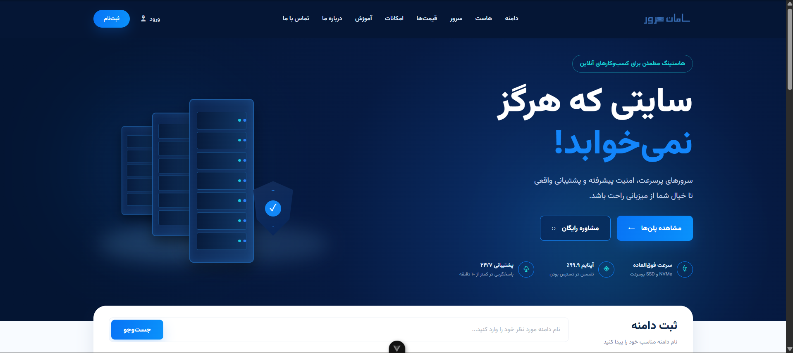
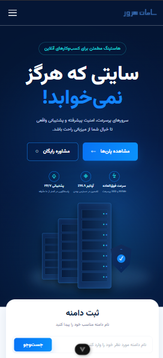
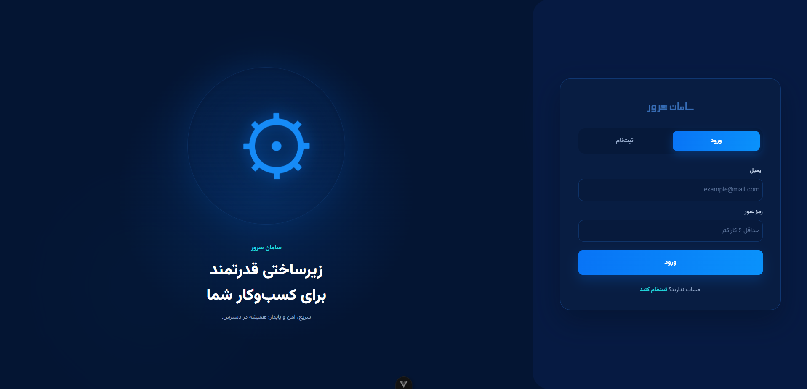
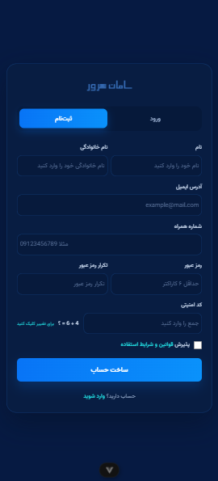

# Saman Server

A modern and responsive hosting website built with Vue 3.

Saman Server is a Persian RTL hosting platform interface designed with a focus on clean UI, responsive layouts, and a user-friendly experience across desktop and mobile devices.

## Preview

### Desktop



### Mobile



### Login & Signup Desktop



### Login & Signup Mobile



## Features

* Responsive design for desktop, tablet, and mobile
* Persian RTL interface
* Modern hosting and server landing page
* Hosting plan sections
* Domain pricing section
* Login and signup interface
* Responsive mobile navigation
* Reusable Vue components
* Clean and component-based structure

## Tech Stack

* Vue 3
* TypeScript
* JavaScript
* HTML5
* CSS3
* Vite
* Vue Router
* Git & GitHub

## Project Structure

```text
src/
├── assets/
├── components/
├── views/
├── router/
├── App.vue
└── main.ts

public/
└── screenshots/
```

## Getting Started

### 1. Clone the repository

```bash
git clone https://github.com/Ali-Reihani/saman-server.git
```

### 2. Navigate to the project

```bash
cd saman-server
```

### 3. Install dependencies

```bash
npm install
```

### 4. Start the development server

```bash
npm run dev
```

The application will be available at the local development URL provided by Vite.

## Design & Development

The interface was designed and implemented with a focus on:

* Responsive layouts
* RTL user experience
* Reusable components
* Consistent spacing and typography
* Mobile-first considerations
* Clean and maintainable frontend code

## Status

This project is currently a frontend implementation.

## Author

**Ali Reihani**

Frontend Developer focused on Vue.js and TypeScript.

GitHub:
https://github.com/Ali-Reihani
